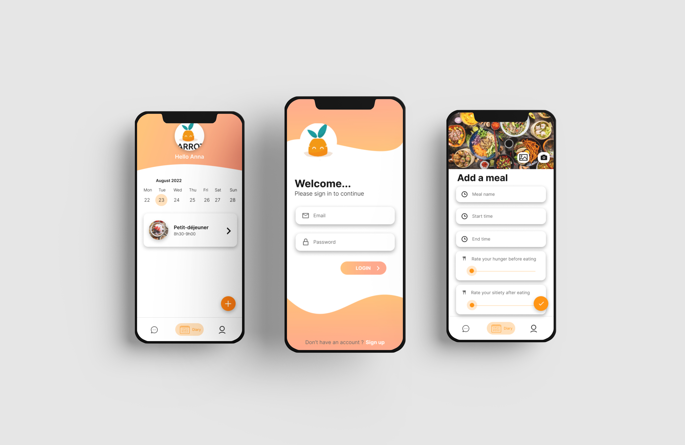
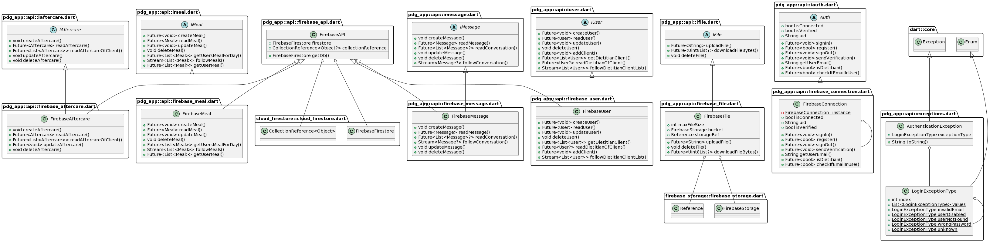

[](https://github.com/marketplace/actions/super-linter)


<br />
<br />
<br />

<p align="center">
  
</p>

# 🥕 Careot

Careot est une application mobile de suivi diététique basée sur Flutter et Firebase.

Jetez un oeil à [notre site](https://les-crepes.github.io/) pour une présentation de l'application



## 📕 Sommaire

-   [🥕 Careot](#-careot)
    -   [📕 Sommaire](#-sommaire)
    -   [🐣 Télécharger l'application](#-télécharger-lapplication)
    -   [🔨 Build](#-build)
    -   [🤝 Contribution](#-contribution)
        -   [🤸‍♂️ Méthode de travail](#️-méthode-de-travail)
        -   [🤖 Cacher les fichiers générés automatiquement](#-cacher-les-fichiers-générés-automatiquement)
        -   [📶 Infrastructure](#-infrastructure)
        -   [📂 Structure de dossiers](#-structure-de-dossiers)
        -   [📚 Libraries & Outils utilisés](#-libraries--outils-utilisés)
        -   [👀 Test](#-test)
    -   [📖 Documentations suplémentaires](#-documentations-suplémentaires)
        -   [Flutter](#flutter)
        -   [Firebase](#firebase)
        -   [API](#api)
        -   [Frontend](#frontend)

## 🐣 Télécharger l'application

Vous trouverez la version Android de l'application dans la section [release](https://github.com/les-crepes/CAREOT_APP/releases) de Github.

Il est possible que dans le futur une version IOS soit disponible donc tenez vous au courant.

**Guide d'installation Android**

1.  Téléchargez le dernier APK sur votre téléphone.
2.  Autorisez votre explorateur de fichier ou autre application à installer des `.apk` depuis une source externe.
3.  Puis lancez l'installation. 😉

## 🔨 Build

Si vous souhaitez build l'application vous-mêmes, veuillez suivre les étapes ci-dessous:

1.  Installez [Flutter](https://docs.flutter.dev/get-started/install)
2.  Clonez notre repository
3.  `cd CAREOT_APP/`
4.  `flutter pub get` Installer les dépendances
5.  `flutter packages pub run build_runner build --delete-conflicting-outputs` Nous utilisons le package Auto_route qui génère automatiquement des fichiers. Si vous souhaitez ne pas executer cette commande à chaque modification du code source, vous pouvez alors utiliser cette commande à la place `flutter packages pub run build_runner watch`
6.  `flutter build apk --release` Build un apk en monde release

## 🤝 Contribution

Si vous voulez contribuer à notre projet, il faudra effectuer un fork de notre repository et suivre les étapes ci-dessous:

### 🤸‍♂️ Méthode de travail

1. Sélectionner le projet Github, prendre ou ajouter une tâche dans l'onglet TODO.
2. Créer un issue dans le repository correspondant
3. S'assigner à l'issue et ajouter les tags nécessaires (frontend, backend, bug, ehancement etc...)
4. Créer une branche associée à l'issue (petit bouton dans issue: create branch)
5. Charger la branche en local (copier la commande fournie par l'utilitaire)
6. Réaliser les modifications
7. Lancer les tests en local -> `flutter test`
8. Lancer le linter -> `flutter analyze`
9. Après validation, push sur la nouvelle branche dans la remote origin.
10. Créer une Pull Request et attendre un review d'un pair
11. Supprimer la branche après la fusion avec la branche principale (main)

Pour plus d'informations, vous pouvez consulter notre [cahier des charge](https://github.com/les-crepes/.github/blob/main/cahier_charge.md)

### 🤖 Cacher les fichiers générés automatiquement

**Android Studio**

Pour cacher les fichiers générés, rendez-vous dans `Preferences` -> `Editor` -> `File Types` et collez la ligne ci-dessous dans `ignore files and folders`:

```
*.g.dart;
```

**Visual Studio Code**

Rendez-vous dans `Preferences` -> `Settings` et chercher à l'aide de la barre de recherche `Files:Exclude`. Puis ajoutez cette ligne:

```
**/*.g.dart
```

### 📶 Infrastructure

Nous utilisons Flutter pour l'application et trois services Firebase:

-   Storage: afin de stocker les fichiers
-   Authentication: afin d'authentifier nos utilisateurs
-   Firestore: afin de stocker nos données au format NoSql


### 📂 Structure de dossiers

Voici la structure de fichiers que fournit flutter.

```
CAREOT_APP
├── android
├── assets
├── build
├── ios
├── lib
├── linux
├── macos
├── test
├── web
└── windows
```

Voici la structure de fichiers que nous avons mis en place.

```
/lib
├── api
├── model
├── provider
├── router
├── screens
├── scripts
└── widgets
    ├── buttons
    ├── cards
    ├── client_list
    ├── diary
    ├── forms
    ├── login
    ├── profile
    └── register
```

Plongeons maintenant plus en détail dans le dossier /lib qui contient le code principal de notre application.

```
1- api — Ce dossier contient les classes permettant de récupérer les données venant de l'éxtérieur(firebase).
2- model — Ce dossier contient les différents modèles que nous utilisons.
3- provider — Ce dossier contient nos provider. Ils contiennent la partie logique de l'app.
4- router — Ce dossier contient l'arboressence de nos différents screens.
5- screens — Ce dossier contient les classes qui assemblent nos différents éléments graphique.
6- scripts — 
7- widgets — Ce dossier contient tous les éléments graphiques.
8- main.dart - Le point d'entrée de notre application.
```

### 📚 Libraries & Outils utilisés

-   [firebase_core](https://pub.dev/packages/firebase_core)
-   [auto_route](https://pub.dev/packages/auto_route)
-   [firebase_auth](https://pub.dev/packages/firebase_auth)
-   [firebase_storage](https://pub.dev/packages/firebase_storage)
-   [cloud_firestore](https://pub.dev/packages/cloud_firestore)
-   [firebase_database](https://pub.dev/packages/firebase_database)
-   [provider](https://pub.dev/packages/provider)
-   [flutter_chat_ui](https://pub.dev/packages/flutter_chat_ui)
-   [table_calendar](https://pub.dev/packages/table_calendar)
-   [intl](https://pub.dev/packages/intl)
-   [uuid](https://pub.dev/packages/uuid)
-   [image_picker](https://pub.dev/packages/image_picker)
-   [cross_file_image](https://pub.dev/packages/cross_file_image)
-   [day_night_time_picker](https://pub.dev/packages/day_night_time_picker)
-   [google_nav_bar](https://pub.dev/packages/google_nav_bar)
-   [path_provider](https://pub.dev/packages/path_provider)
-   [get_it](https://pub.dev/packages/get_it)
-   [firebase_auth_mocks](firebase_auth_mocks)
-   [firebase_storage_mocks](https://pub.dev/packages/firebase_storage_mocks)
-   [file_picker](https://pub.dev/packages/file_picker)
-   [file](https://pub.dev/packages/file)
-   [awesome_snackbar_content](https://pub.dev/packages)
-   [sorted_list](https://pub.dev/packages/sorted_list)
-   [async](https://pub.dev/packages/async)
-   [url_launcher](https://pub.dev/packages/url_launcher)
-   [tuple](https://pub.dev/packages/tuple)
-   [flutter_svg](https://pub.dev/packages/flutter_svg)
-   [flutter_dotenv](https://pub.dev/packages/flutter_dotenv)
-   [sticky_headers](https://pub.dev/packages/sticky_headers)

### 👀 Test

Afin de respecter nos conventions de codage il faudra que les commandes ci-dessous n'échouent pas:

-   `flutter analyze`
-   `flutter test`

## 📖 Documentations suplémentaires

### Flutter

Afin de débuter avec le développement de flutter il faut se référer à la [documentation en ligne](https://docs.flutter.dev/), qui propose des conseils, les références API ainsi que des examples.

### Firebase

-   Afin de travailler avec la base de donnée noSql: [Documentation FireStore](https://firebase.google.com/docs/firestore/)
-   Afin de travailler avec le service d'identification: [Documentation Authentication](https://firebase.google.com/docs/auth/flutter/start)
-   Afin de travailler avec les fichiers: [Documentation Storage](https://firebase.google.com/docs/storage/flutter/start)

### API

Comme nous utilisons Firebase, nous n'avons pas d'API. Cependant, nous avons une structure similaire qui permet de traiter les données.

Afin de travailler sur les données (CRUD et autre), nous utilisons une interface par type de donnée qui nous permet de changer de services rapidement. Par exemple, nous avons une classe FirebaseMessage qui implémente l'interface IMessage. De cette manière, si on utilisait un autre service, par exemple atlasDB nous pourrions créer la classe AtlasdbMessage.

Exemple pour utiliser l'API Firebase dans notre application.

```
IMessage messageApi = FirebaseMessage();

messageApi.createMessage();
messageApi.readMessage();
messageApi.updateMessage();
messageApi.deleteMessage();
messageApi.implementNewBadassFunctions(with, crazy, parameters);
...

```



### Frontend

Nous utilisons les providers pour séparer la logique de l'interface.
